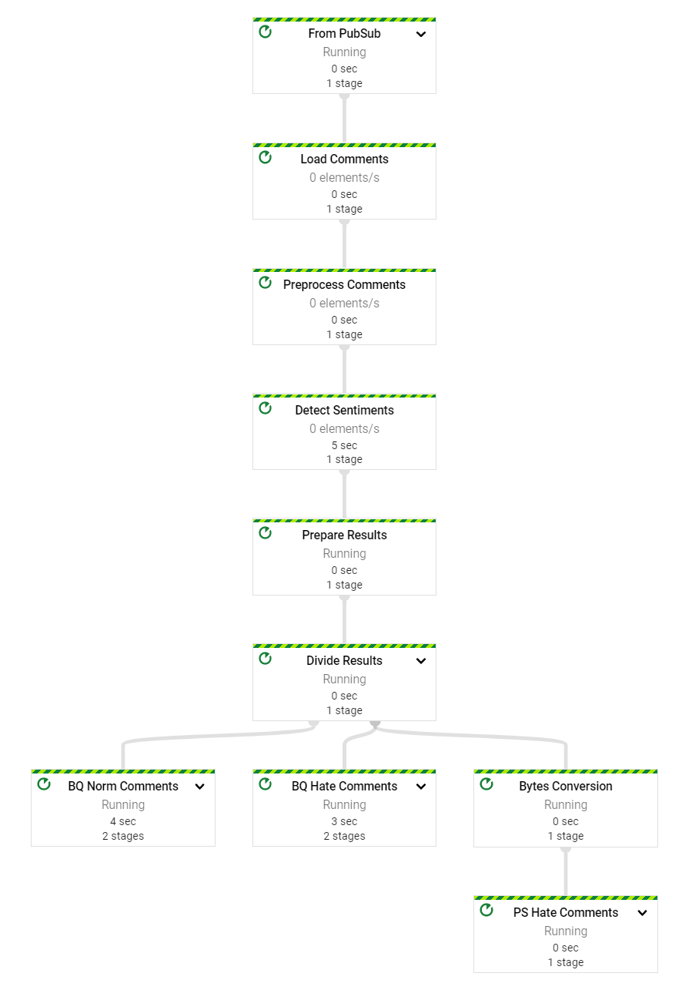
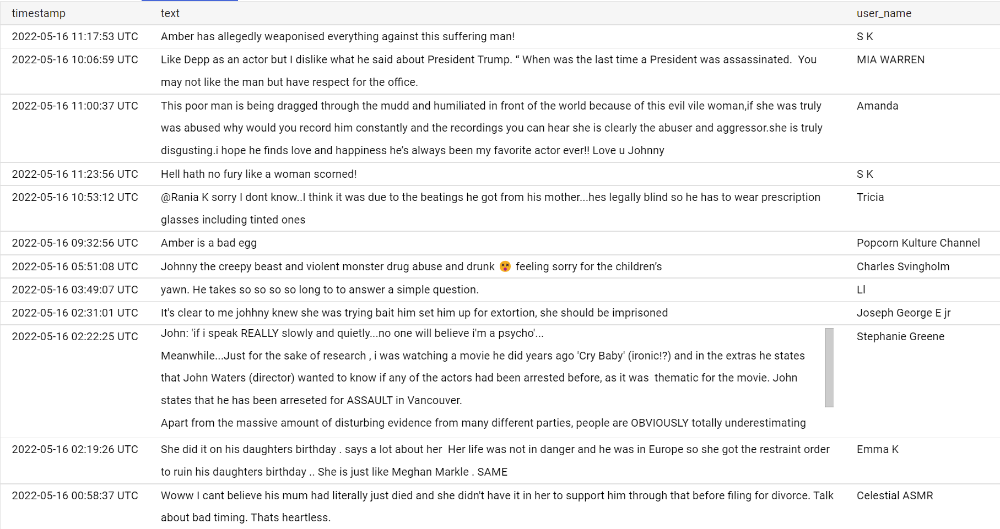
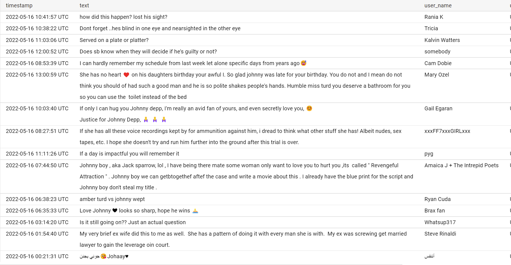

# Hate Speech Detection Pipeline on Google Cloud Platform
- In this project I have built a fully working, end to end, real time hate speech detection system on Google Cloud Platform.
- The system detects hate speeches in YouTube comments in a streaming fashion.

## The Pipeline


## Working Mechanism
1. A [producer](tools/yt_comments_producer.ipynb) fetches YouTube comments and produces them to a specified PubSub topic.
2. The DataFlow pipeline connects to the same topic and waits for the messages from producer.
3. When it receives the message, it preprocesses the comment text and calls Google Cloud Natural Language API to 
detect the sentiment score of the comment.
4. Any comment which has a sentiment score <= -0.6 is considered as hate speech.
5. The pipeline has 3 different sinks
    1. A PubSub topic to send hate speech comments.
    2. A BigQuery table to send hate speech comments.
    3. A BigQuery table to send normal speech comments.
6. Hate speech comments will be sent both to a PubSub topic and to a BigQuery table.
7. Normal speech comments will be sent just to a BigQuery table.
8. Any downstream application can consume results of the pipeline from the output PubSub topic and take relevant decisions as to 
what to do with it.
9. The data in BigQuery tables can be used for analysis purposes.


## Launching the pipeline
- Create a Vertex Ai WorkBench instance with apache beam environment.
- Clone this repository.
- Navigate to the project root
```shell
cd Hate-Speech-Detection-Pipeline-on-GCP
```
- Install the required dependencies
```shell
pip3 install -r requirements.txt
```
- The pipeline can either be run locally on the same terminal itself or it can be run as a Google Cloud DataFlow job.
- Local pipeline runs are used to test the pipeline to make sure there aren't any programming errors or bugs which 
might cause problems with pipeline execution.
- DataFlow pipelines run on infrastructure managed by Google and are used for final deployment.

### To launch the pipeline locally
```shell
python3 hs_main.py --project=<gcp-project-id> --region=<region> --bucket=<bucket-name> --input-topic=<input-pubsub-topic> --output-topic=<output-pubsub-topic> --direct-runner
```
### To launch the pipeline as a DataFlow job
```shell
python3 hs_main.py --project=<gcp-project-id> --region=<region> --bucket=<bucket-name> --input-topic=<input-pubsub-topic> --output-topic=<output-pubsub-topic> --setup-file='./setup.py' --dataflow-runner
```
- DataFlow jobs can be monitored and managed in [Dataflow web console](https://console.cloud.google.com/dataflow/jobs).

## Results
- This system depends on Google Cloud's Natural Language API to detect the sentiment. 
- Hence, the system is only as good as the API. This shouldn't be a big problem as Google Cloud has one of the best APIs out there.
- I ran the system on the comments in Johnny Depp and Amber Heard trial videos as it's a trending topic at this moment, and 
Amber Heard seems to be is getting harassed everywhere on social media.

### Hate speech comments detected 


### Normal speech comments

